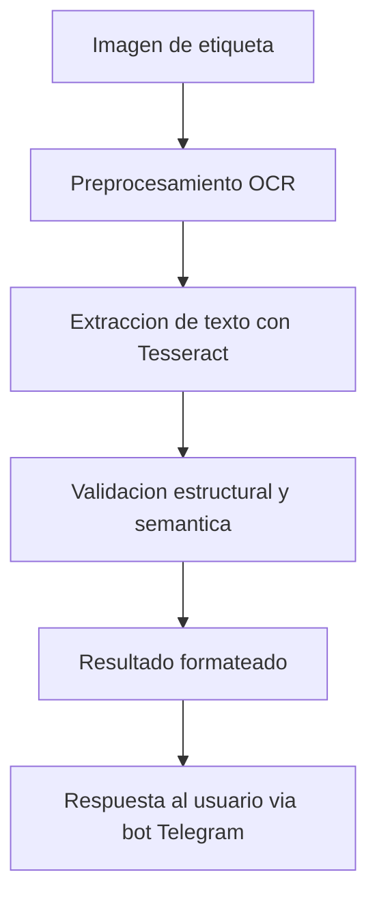

# 🏗️ Arquitectura del Sistema y Modelado

## 1. Tipo de modelo seleccionado y justificación

Se seleccionaron modelos de clasificación supervisada para validar si una etiqueta OCR extraída corresponde a una estructura válida. Luego de comparar diversas técnicas (Random Forest, SVM, Redes Neuronales, Transformers, CNN), se optó por un enfoque con **Random Forest** como baseline por su bajo costo computacional, interpretabilidad y buen desempeño con datos estructurados.

Para reconocimiento de texto, se empleó **OCR con Tesseract** por su robustez, soporte comunitario y facilidad de integración en Python. En fases posteriores, se evaluó el uso de EasyOCR como alternativa basada en deep learning.

## 2. Arquitectura detallada

El sistema se divide en tres componentes principales:

### A. Módulo de visión y extracción OCR
- Herramienta: `pytesseract` + `OpenCV`
- Parámetros:
  - Preprocesamiento con escala de grises
  - Umbral adaptativo (cv2.adaptiveThreshold)
  - Corrección de orientación (deskewing)

### B. Validación de estructura
- Clasificación por reglas y ML
- Estructura esperada de etiquetas:
  - Ruta completa: `Ciudad-NodoC-NodoE-NodoB-Ruta-Caja-Color`
  - Ruta no aplica: `Ciudad-NodoC-NodoE-Ruta-Caja-Color`
- Validación de campos mediante expresiones regulares y comparación contra listas válidas.

### C. Bot Telegram
- API: `python-telegram-bot`
- Comandos implementados: `/start`, `/ayuda`, `/salir`
- Funcionalidades:
  - Recibe imagen de usuario
  - Ejecuta OCR y validación
  - Devuelve resultado en formato validado e interpretado

## 3. Diagrama de flujo del sistema

> El diagrama completo está disponible en `/app/assets/diagrama_sistema.png`.

## 4. Pipeline de datos

1. 📥 **Input**: Imagen enviada por el usuario al bot
2. 🎛️ **Preprocesamiento**: OpenCV (escala de grises, binarización, etc.)
3. 🔍 **OCR**: Tesseract o EasyOCR (opcional)
4. 📊 **Validación**: Clasificación + Reglas de estructura
5. 📤 **Output**: Resultado textual formateado + campos extraídos + estado (válido/no válido)

## 5. Tecnologías y librerías utilizadas

| Herramienta / Librería     | Versión usada        | Propósito                                   |
|----------------------------|----------------------|---------------------------------------------|
| Python                     | 3.10+                | Lenguaje principal                          |
| OpenCV                     | 4.x                  | Procesamiento de imágenes                   |
| pytesseract                | 0.3.x                | OCR basado en Tesseract                     |
| scikit-learn               | 1.2.x                | Modelos de ML (Random Forest, validaciones) |
| pandas / numpy             | 1.x                  | Manipulación de datos                       |
| matplotlib / seaborn       | 3.x / 0.12.x         | Visualización de datos                      |
| python-telegram-bot        | 20.x                 | Comunicación con el bot Telegram            |
| EasyOCR (opcional)         | 1.6.x                | OCR alternativo con deep learning           |
| Google Colab / local env   | -                    | Ejecución del sistema                       |
